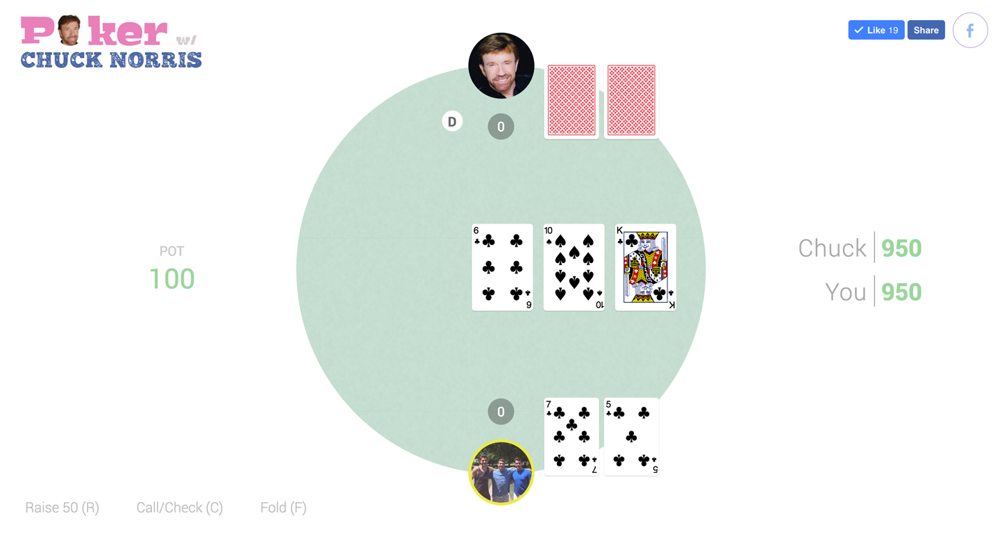

# Poker with Chuck Norris

## Background

Poker with Chuck Norris is a heads up game of Texas Holdem poker. This means that it is just you against Chuck Norris. Each Player is dealt two cards and given another communal 5 cards. The goal is to create the best 5 card hand from the 7 cards.



## The Code

Poker with Chuck Norris was built with React.js. The Game class manages the state of the overall application and passes props to children components, such as "Player" and "Stage." Callback functions passed to "setState" are used to create a loop of sorts that corresponds to turns, rounds, and the overall state of the game.

The Chuck Norris AI uses a poker odds API from Mashape to calculate his hand's chance at winning at any stage in the round. The AI will sometimes decide to defy the odds and bluff or slow play a hand in order to be more unpredictable.

Poker with Chuck Norris has extensive logic for handling the strongest hand down to the very last tiebreaker. This is handled by the class 'PokerHand', which also includes several helper functions:

```javascript

export class PokerHand {

  constructor(stage, hand) {
    
    this.pile = stage.concat(hand);
    this.ranks = this.ranks(this.pile);
    // this.pile = this.bestHand(pile);
  }

  bestHand() {
    let hands = this.hands();
    for (let hand in hands) {
      let value = RANKS[hand];

  ...
```

At the end of each round, the game will notify the user of the hands created, and which is stronger.
